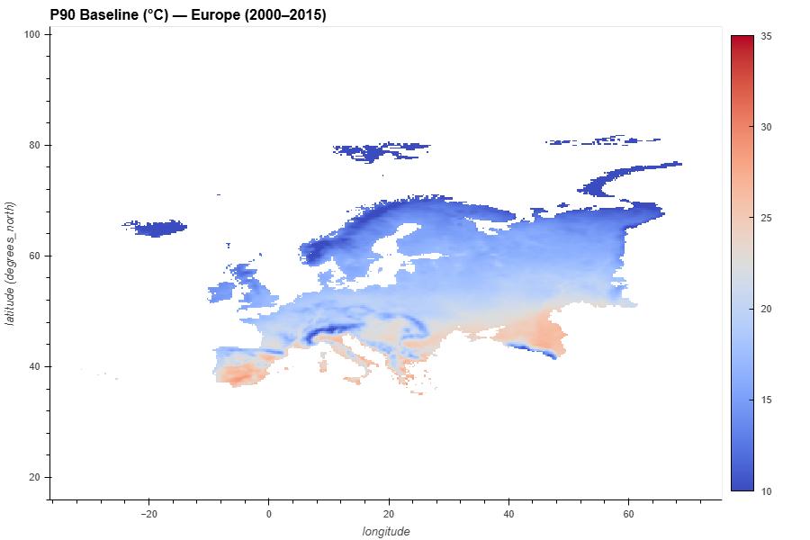
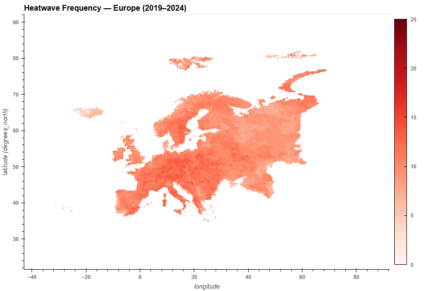
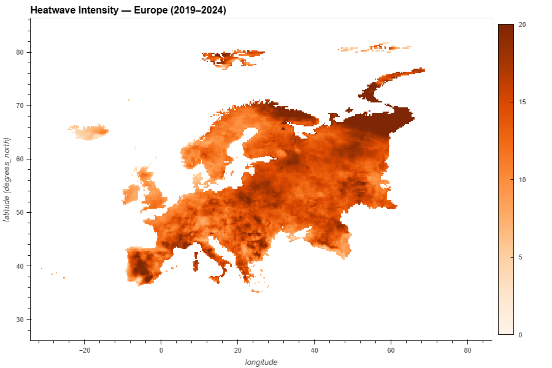

# 🌡️ Heat-Waves

**Python workflows and notebooks for detecting, analyzing, and visualizing heatwave events**

---

## 📋 Overview

### What Are Heat Waves?

Heat waves are **prolonged periods of excessively high temperatures** that pose severe risks to:
- 🌍 **Ecosystems** - disrupted habitats and species stress
- 👥 **Human Health** - heat-related illnesses and mortality
- 🏗️ **Infrastructure** - system failures and energy demands

### Climate Change Impact

> Globally, these events are becoming **more frequent, intense, and longer-lasting** due to climate change. Rising greenhouse gas emissions have amplified global warming, shifted temperature distributions, and increased the likelihood of extreme heat events. 
>
> Scientific evidence shows that even a small increase in average global temperature significantly raises the probability of **record-breaking heat waves**. These changes threaten **food security**, **water resources**, **energy systems**, and **urban environments**, making heat wave analysis critical for climate adaptation, disaster risk reduction, and public health planning.

---

## 📊 Key Visualizations

### 1️⃣ **P90 Map** - Temperature Baseline

**90th percentile (P90) temperature baseline** established over a **15-year reference period (2000–2014)** to define heatwave thresholds.

This percentile-based approach:
- Identifies months where temperatures deviate significantly from **historical norms**
- Enables **consistent classification** of extreme temperature events across the study area
- Classifies any monthly mean temperature exceeding this threshold as a **heatwave month**

---

### 2️⃣ **Frequency Map** - Heatwave Occurrence

**Number of months globally where the mean temperature exceeded the P90 baseline.**

This metric shows how often heatwave conditions were observed across different regions.

---

### 3️⃣ **Intensity Map** - Temperature Severity

**Cumulative sum of temperature exceedances (in °C)**, providing a measure of **warming magnitude** beyond the climatological norm.

This visualization highlights the severity and scale of temperature anomalies.

